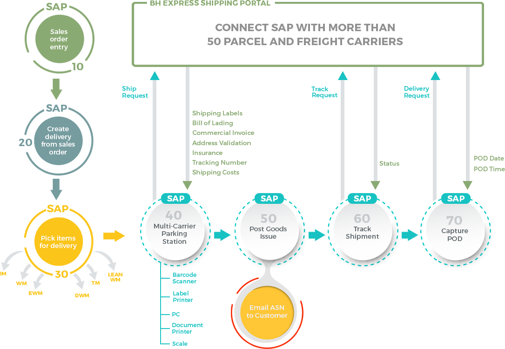
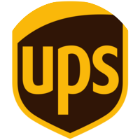
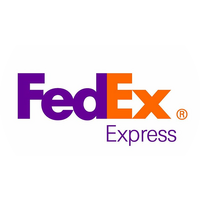
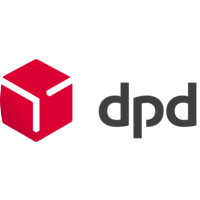
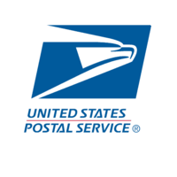
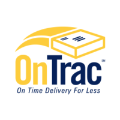
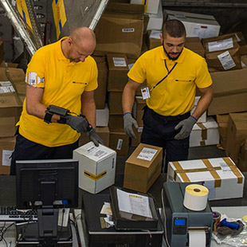

:showtitle: This is the showtile 
:site-title: Hi there!
:page-title: Parcel and Freight Shipping for SAP
:page-description: Powerful embedded shipping platform that uses modern integration to connect SAP to parcel carriers
:page-author: https://www.linkedin.com/in/joshriff
:page-copyright: Common Commons license BY-NC-ND

link:#page-top[]

link:#services[About]{nbsp}{nbsp}{nbsp}{nbsp}{nbsp}
link:#portfolio[Library]{nbsp}{nbsp}{nbsp}{nbsp}{nbsp}
link:#about[FAQs]{nbsp}{nbsp}{nbsp}{nbsp}{nbsp}
link:#timeline[Carrier List]{nbsp}{nbsp}{nbsp}{nbsp}{nbsp}
link:#team[Request Demo]{nbsp}{nbsp}{nbsp}{nbsp}{nbsp}
link:#contact[Contact]{nbsp}{nbsp}{nbsp}{nbsp}{nbsp}
https://www.upwork.com/services/product/an-express-parcel-shipping-solution-for-sap-ecc-s-4hana-1538703549659963392[Order Now!]

//= Express Shipping for SAP

== Express Shipping Solution

Parcel & Freight Extension for SAP

link:#services[Tell Me More]

[[services]]
== Tender Packages on SAP

=== Generate real value for your customers by adding shipping functions to create an always-on, always-connected, real-time, transparent supply chain

[.fa-stack .fa-4x]# __ __ #

[E-Commerce and Omnichannel]
====
A powerful embedded shipping platform that uses modern integration
technology to tender packages and freight. Activate shipping in your
existing SAP system and work directly with your transportation partners.

[.fa-stack .fa-4x]# __ __ #
==== 

Pack, Weigh, Label, Ship, Track, Report

Save time and money with this automated, real-time, reliable,
easy-to-use shipping solution. Access a broad network of major carriers
located throughtout the world.

[.fa-stack .fa-4x]# __ __ #

== 

Smart Digital Network with ASN & POD

With the touch of a button, communicate electronically with your
carriers to ship from warehouses, distribution centers, and
manufacturing sites. Suports many distribution scenarios, including high
volume, B2C, B2B, and third-party distribution to support Amazon, Home
Depot and the like.

[[portfolio]]
== 

Resource Library

=== 

Learn even more about the Express Shipping Solution and the value it
brings to your company. Our API-based shipping product isn’t only about
the physical transportation of goods. It is enabling technology for
interconnected data flows and supply chain networks. Leverage SAP Best
Practices for small package and freight shipping.

link:#p1[]

__

== Improving Profit and Customer Service with the Express Shipping Solution

The Express Shipping Solution Case Study

link:#p2[]

__

== The Right Stuff

A Spotlight on the Express Shipping Solution in Parcel Industry Magazine

link:#p3[]

__

== Business Process Flow

SAP Best Practices for Shipping

link:#p4[]

__

image:assets/xss/slide-05.jpg[image]

== The Express Shipping Solution Video

Overview of parcel shipping software for SAP

link:#p5[]

__

== Carrier Shipping Integration Guide

The Express Shipping Solution Whitepaper

[[p1]]
== Improving Profit and Customer Service with teh Express Shipping Solution

A Case Study Highlighting Shipping Via the Cloud with SAP and Carrier
Web Services

image:assets/xss/slide-03.jpg[parcel shipping for SAP -
case study]

=== ABSTRACT

For customers who are seeking ways to drive more efficiency from their
shipping processes and derive more value from their software
investments, the Express Shipping Solution provides a set of tools that
can connect your SAP-based shipping functions directly to those offered
by parcel carriers such as UPS, FedEx, USPS and DHL via the shippers’
own web services. This case study focuses on a recent implementation of
the Express Shipping Solution at a large pharmaceutical company. This
implementation was a successful example of how the Express Shipping
Solution combines the native tools available in SAP, including the
Express Ship Interface, and the cloud-based shipping services offered by
parcel carriers, to improve the efficiency of a large shipping
operation.

The Express Shipping Solution Case Study:
https://www.slideshare.net/BlueHarbors/case-study-express-shipping-solution-for-sap-78101294[Improving
Profit and Customer Service with the Express Shipping Solution].

__ Close Project

[[p2]]
== The Right Stuff

A Spotlight on the Express Shipping Solution in Parcel Industry Magazine

image:../shipping-interface/assets/portfolio/slide-04.jpg[SAP shipping news]

[[abstract]]
=== Abstract

Did you know that your SAP system comes loaded with a set of tools that
connect you directly to parcel carriers such as UPS, FedEx, USPS, and
DHL? Here we explore the SAP components that will have you shipping
small package and freight straight from SAP in a matter of weeks, not
months. In addition to the technology aspects of shipping, we’ll discuss
business drivers and trends that are attracting companies to adopt SAP’s
shipping solution. This information is useful for companies interested
in using the API and Web Service solutions offered by parcel carriers.

Article published in Parcel Industry Magazine:
http://parcelindustry.com/article-3929-the-right-stuff-a-spotlight-on-sap's-shipping-technology.html[The
Right Stuff: a Spotlight on SAP’s Shipping Technology].

__ Close Project

[[p3]]
== Business Process Flow

SAP Best Practices for Shipping

image:assets/img/portfolio/process.png[image alt text]

__ Close Project

[[p4]]
== The Express Shipping Solution Video

Overview of parcel shipping software for SAP

image:[image]

=== Key Features of the SAP Express Shipping Solution

* Generate labels for all connected carriers in SAP
* SAP Master Data Integration
* Scale & Bar Code Scanning Support
* Custom Shipping Preference Defaults
* Rate Procurement with Real-Time Carrier Selection
* Reverse Logistics Capabilities
* Tracking Number Creation
* Track Shipments in SAP
* Day End Close Activities

__ Close Project

[[p5]]
== Carrier Shipping Integration Guide

Selecting the Best Solution to Integrate Shipping Functions in SAP with
Parcel Carriers

image:../shipping-interface/assets/portfolio/slide-02.jpg[Shipping for SAP]

A guide to developing an integrated SAP shipping strategy, assessing
needs, and understanding the basic functionality offered by various
internet-enabled supply chain shipping solutions.

=== A Competitive Necessity

For companies with a shipping function, the Internet has become a
critical tool for business integration. It fosters greater cooperation
between trading partners and allows companies to work with their supply
chain partners to better serve customers, increase profits and drive
down costs. However, with this capability comes some challenges. For
many companies, selecting the right tools to drive cooperation and
integration with partners can be a difficult choice. The selection must
be made carefully with the ultimate goal in mind: to improve customer
experience while also driving increased profitability and reduced costs,
with minimal organizational risk. The goal of this white paper is to
help companies understand the need for an integrated shipping strategy,
determine how to assess their needs, and to understand and compare the
basic functionality that is offered by various internet-enabled supply
chain shipping solutions. As part of this, we will discuss how
internet-based API shipping can help organizations better serve their
customers, while also increasing profits and driving down costs.

The Express Shipping Solution Whitepaper:
https://www.slideshare.net/BlueHarbors/blueharborwhitepages[Carrier
Shipping Integration Guide].

__ Close Project

[[about]]
== Frequently Asked Questions

=== Small Package and Freight Extension for SAP Software

== How does the Express Shipping Solution provide value for my customers and furnish competative advantage to my company?

Provide your customers with streamlined reliable shipping services.
Define customer preferences and leverage exsiting SAP data to reduce
shipping errors and eliminate the need to synchonize data between
applications. The customer’s ordering experience is improved, driven by
dependable, simple, trouble-free shipping. Key metrics, such as “On
time, In full” (OTIF) improve as a result.

== How does the Express Shipping Solution deliver ROI and improve warehouse effeciencies?

Shipping is seamlessly imbedded into existing logistics business
processes and transactions (sales orders, deliveries, and shipments),
providing ease-of-use to Order Taking and Order Fulfillment Teams.
Additionally, automation and warehouse efficiencies come from
integrating SAP with conveyors, scales, scanners, and other devices.

== How does the Express Shipping Solution improve shipping visability and manage carrier performance?

Shipping progress is visable from all standard logistics documents with
real-time parcel tracking. Proof Of Delivery (POD) details are captured
in the system for use in building shipping metrics. Monitoring and
reporting of shipping activity highlights delivery exeptions.
Proactively alert customers delays, quickly raise issues to the
carriers, and minimize billing errors.

[[timeline]]
== 

Work with Your Favorite Carriers

=== Generate superior value for your customers and improve end-to-end value chains by adding time-critical shipping functions to your SAP system. Experience these benefits:

* {blank}
+

+
===== 

Ship with UPS…

Efficient Processing

Generate and print carrier-specific shipping lables and documents
directly from SAP
* {blank}
+

+
===== 

Ship with FedEx…

===== Real Time Visability

Perform Parcel Tracking within SAP. Capture Proof of Delivery (POD)
details, including the delivery date and time, and name of person who
signed for package.
* {blank}
+

+
===== 

Ship with DHL…

===== Automate and Streamline Logistics Processes

Connect Weighing Scales, Barcode Scanners, and Label Printers to SAP
* {blank}
+

+
===== 

Ship with DPD…

===== Monitor and Manage Carriers

Capture the freight costs, tracking numbers and POD details of each
shipment in data lakes for reporting
* {blank}
+

+
===== 

Ship with USPS…

===== Supports Demanding and Complex Transportation

Select multi-carrier, mutli-modal, multi-service options to reach
customers located throughout the world
* {blank}
+
image:assets/xss/carriers/circlePUROLATOR.png[SAP shipping for
Purolator]
+
===== 

Ship with Purolator…

===== Reduce Shipping Errors

Validate ship-to addresses when requesting shipping labels
* {blank}
+
image:assets/xss/carriers/circleCANADAPOST.png[SAP shipping for
Canada Post]
+
===== 

Ship with Canada Post…

===== Minimize Data Syncing Errors

Leverage Existing SAP Data to Generate and Print Labels
* {blank}
+

+
===== 

Ship with OnTrac…

===== Prepare for Carrier Pickup

Print an End of Day Shipment Manifest for the Carriers’ drivers
* {blank}
+
===== Many more carriers available!

[[team]]
== Request a Product Demonstration

=== 

== Agenda (50 minutes)

- Overview of Solution Functionality +
- Carrier Network +
- Shipping Services and Capabilities +
- Solution Technology +
- Live Demonstration in SAP S/4HANA +
- Overview of Implementation Project

== Purpose

Learn about a powerful SAP shipping extension that uses state-of-the-art
integration tools to communicate with carriers located throughout the
world. Activate shipping in your existing SAP system and start working
with your favorite transportation partners.

== Schedule Demo

== Location

This live presentation will be conducted online.

[[clients]]
https://www.mckesson.com/[]

https://www.hookerfurniture.com/[image:assets/xss/clientHOOKER.png[Hooker
Furniture]]

https://www.fxi.com/[]

https://carpenter.com[]

[[contact]]
== 

Contact

=== 

link:+12402240609[Call +1 (240) 224-0609]

mailto:info@blueharbors.com[Email info@blueharbors.com]

https://www.upwork.com/services/product/an-express-parcel-shipping-solution-for-sap-ecc-s-4hana-1538703549659963392/[Get
started today. Purchase the ready-to-implement solution on Upwork now!]

[[success]]Send Message

[.copyright]#Copyright © Parcel and Freight Shipping For SAP 2022#

* https://www.linkedin.com/company/blueharbors[__]

* link:legal[Privacy Policy]
